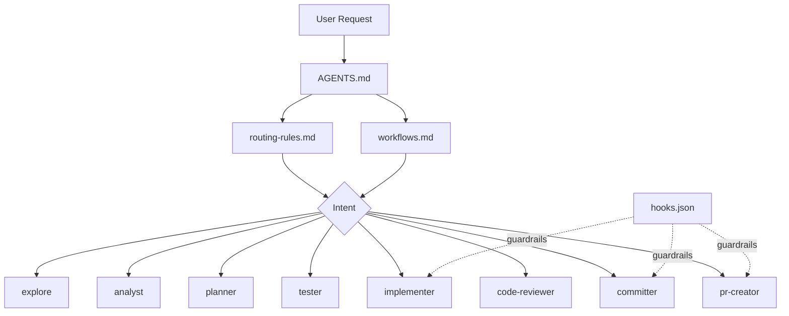
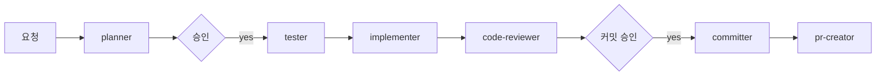

# Keepiluv-Agent

Keepiluv-Agent는 Codex 기반 개발을 위해 만든 **에이전트 오케스트레이션 구조** 저장소입니다.

핵심은 단순합니다.

- 요청을 의도에 따라 적절한 agent로 라우팅한다
- 가능하면 **테스트를 먼저 작성**하고 구현한다
- 구현, 리뷰, 커밋, PR을 분리해 품질과 책임을 명확히 한다

### 1. 역할 구조

- `explore`: 위치 찾기, 사용처 검색
- `analyst`: 구조 분석, 문제 진단
- `planner`: 구현 계획, 영향 범위 정리
- `tester`: 실패 테스트/기대 동작 테스트 작성
- `implementer`: 실제 코드 구현
- `code-reviewer`: 품질 검토
- `committer`: 커밋 생성
- `pr-creator`: PR 생성

### 2. 기본 워크플로우

기본값은 **테스트 선행 구현**입니다.

`planner → tester → implementer`

상황별로는 이렇게 확장됩니다.

- 빠른 수정: `explore → tester → implementer`
- 구조 개선: `analyst → planner → tester → implementer`
- 품질 우선: `planner → tester → implementer → code-reviewer`

### 3. 중요한 운영 원칙

- 키워드보다 **사용자 의도**를 우선 해석
- 한 본작업은 한 agent가 책임진다
- 계획이 필요한 작업은 승인 후 진행한다
- 커밋은 항상 사용자 승인 후 실행한다
- 테스트가 어렵지 않다면 구현 전에 성공 기준을 먼저 고정한다

## 시각화

### 전체 구조

### 기본 실행 흐름

## 어디부터 보면 되나요?

1. `AGENTS.md`
2. `.codex/docs/routing-rules.md`
3. `.codex/docs/workflows.md`
4. `.codex/agents/`

이 순서만 보면 구조를 거의 파악할 수 있습니다.
