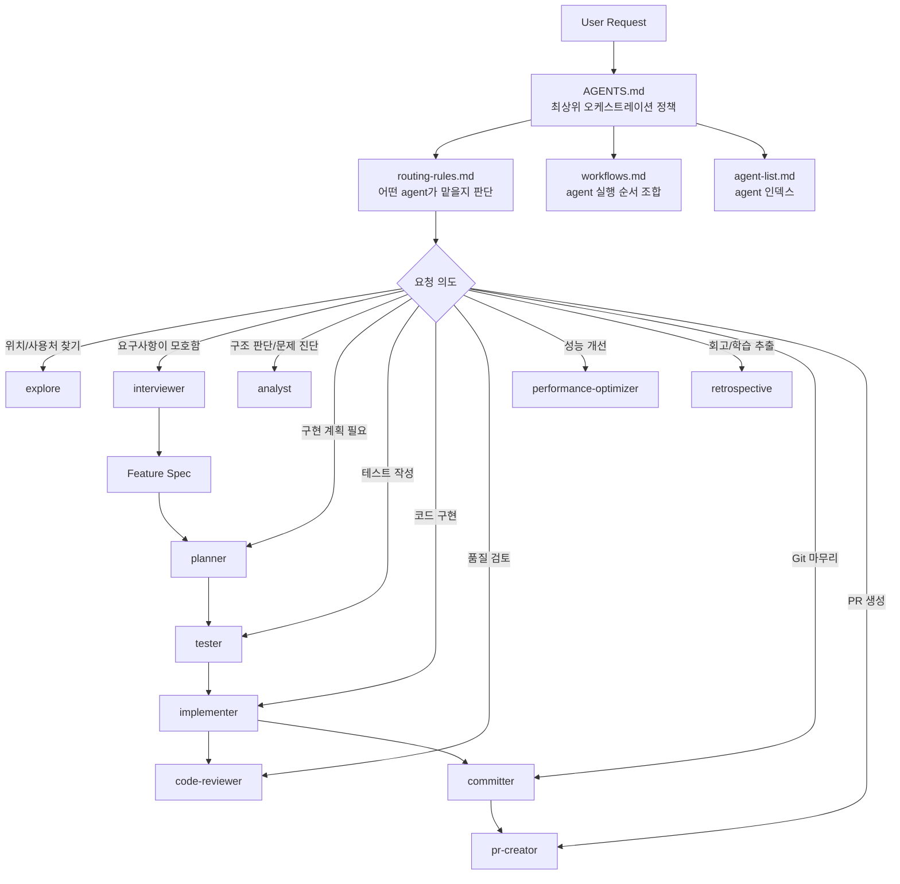
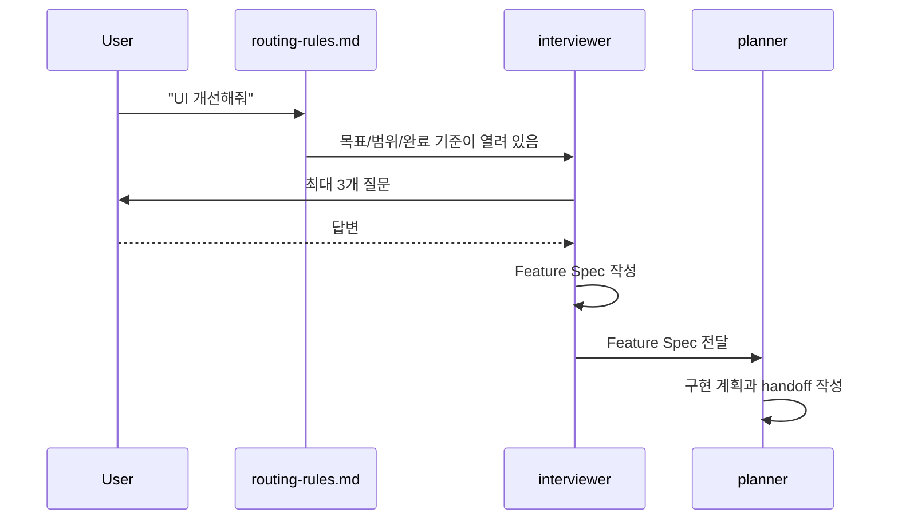
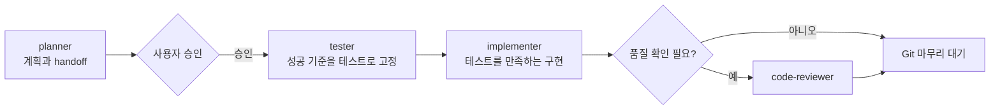
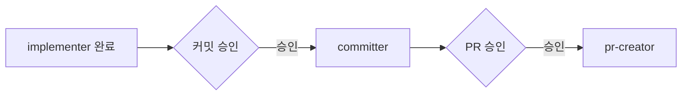
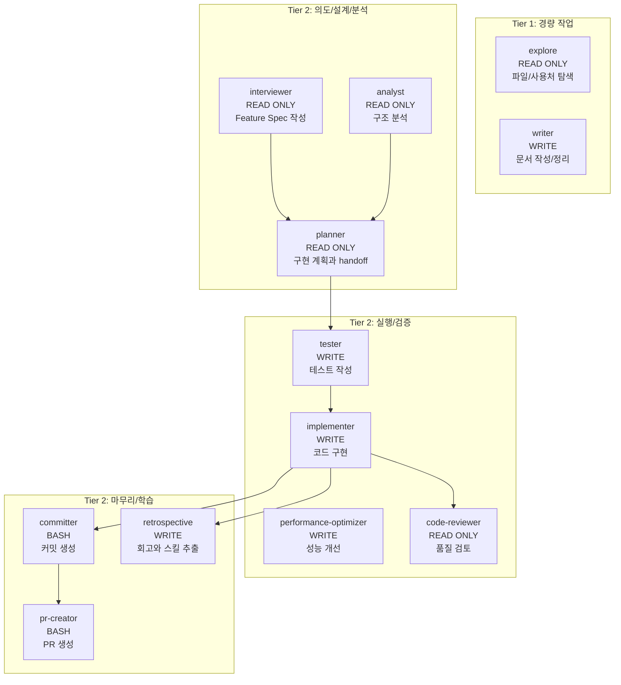
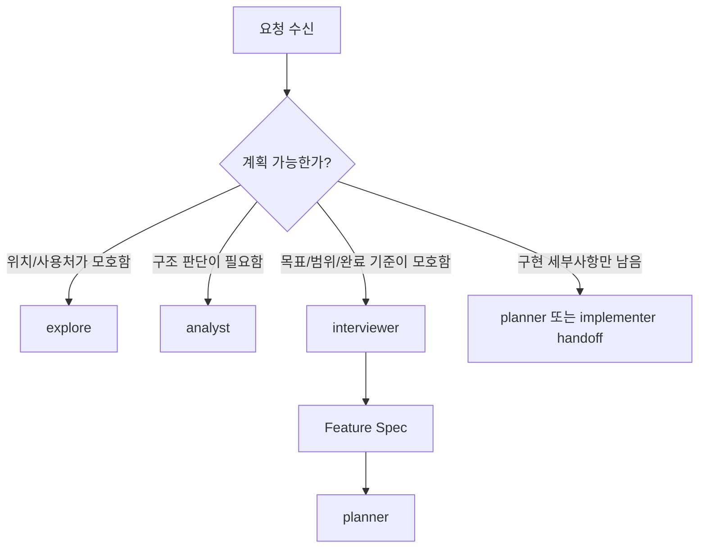
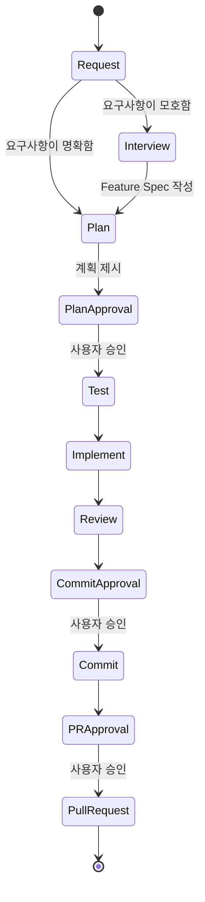
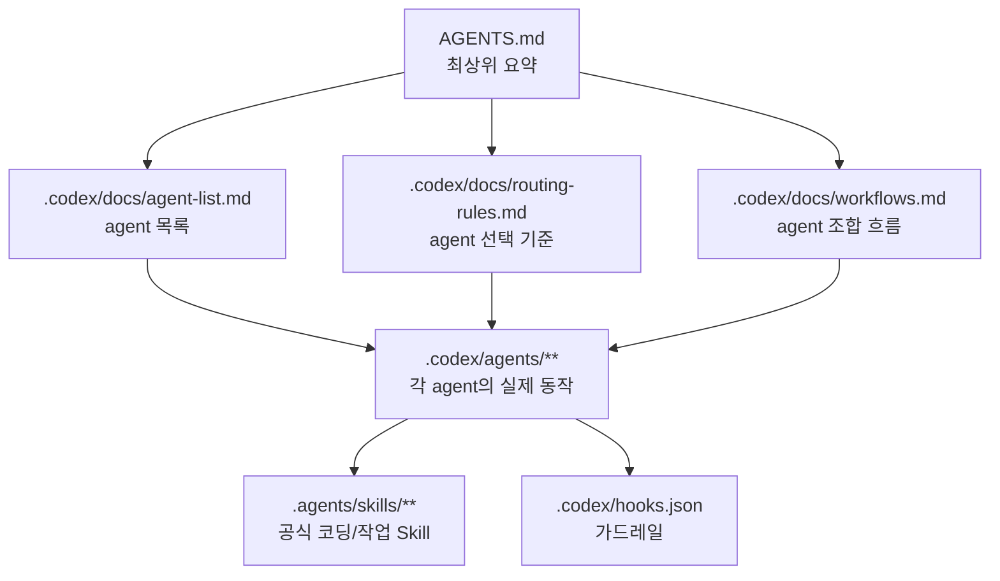

# Keepiluv-Agent

Keepiluv-Agent는 Keepiluv Android 프로젝트에서 Codex를 팀처럼 운용하기 위한
**에이전트 오케스트레이션 문서 세트**입니다.

핵심 목표는 세 가지입니다.

- 사용자의 요청을 의도에 맞는 전문 agent로 라우팅한다.
- 모호한 요구사항은 먼저 `Feature Spec`으로 정리한다.
- 테스트, 구현, 리뷰, 커밋, PR을 분리해 책임과 승인 지점을 명확히 한다.

---

## 작동 원리 한눈에 보기


```mermaid
flowchart TD
    U["User Request"] --> A["AGENTS.md<br/>최상위 오케스트레이션 정책"]

    A --> R["routing-rules.md<br/>어떤 agent가 맡을지 판단"]
    A --> W["workflows.md<br/>agent 실행 순서 조합"]
    A --> L["agent-list.md<br/>agent 인덱스"]

    R --> D{"요청 의도"}

    D -->|위치/사용처 찾기| EX["explore"]
    D -->|요구사항이 모호함| IN["interviewer"]
    D -->|구조 판단/문제 진단| AN["analyst"]
    D -->|구현 계획 필요| PL["planner"]
    D -->|테스트 작성| TE["tester"]
    D -->|코드 구현| IM["implementer"]
    D -->|품질 검토| CR["code-reviewer"]
    D -->|성능 개선| PO["performance-optimizer"]
    D -->|회고/학습 추출| RE["retrospective"]
    D -->|Git 마무리| CO["committer"]
    D -->|PR 생성| PR["pr-creator"]

    IN --> FS["Feature Spec"]
    FS --> PL
    PL --> TE
    TE --> IM
    IM --> CR
    IM --> CO
    CO --> PR
```

---

## 핵심 흐름

### 1. 모호한 요구사항이 있을 때

`interviewer`가 먼저 의도를 정리한 뒤 `planner`로 넘깁니다.


```mermaid
sequenceDiagram
    participant User
    participant Router as routing-rules.md
    participant Interviewer as interviewer
    participant Planner as planner

    User->>Router: "UI 개선해줘"
    Router->>Interviewer: 목표/범위/완료 기준이 열려 있음
    Interviewer->>User: 최대 3개 질문
    User-->>Interviewer: 답변
    Interviewer->>Interviewer: Feature Spec 작성
    Interviewer->>Planner: Feature Spec 전달
    Planner->>Planner: 구현 계획과 handoff 작성
```

`interviewer`의 출력은 구현 계획이 아니라 `Feature Spec`입니다.

```markdown
# Feature Spec

## 목적
## 범위
## 제외
## 완료 기준
## 가정
## 미해결 질문
## 다음 권장 라우팅
```

### 2. 요구사항이 명확할 때

명확한 작업은 바로 `planner → tester → implementer` 흐름으로 진행합니다.


```mermaid
flowchart LR
    P["planner<br/>계획과 handoff"] --> A{"사용자 승인"}
    A -->|승인| T["tester<br/>성공 기준을 테스트로 고정"]
    T --> I["implementer<br/>테스트를 만족하는 구현"]
    I --> Q{"품질 확인 필요?"}
    Q -->|예| R["code-reviewer"]
    Q -->|아니오| G["Git 마무리 대기"]
    R --> G
```

### 3. Git 마무리

커밋과 PR은 구현 agent가 직접 처리하지 않습니다.


```mermaid
flowchart LR
    I["implementer 완료"] --> C1{"커밋 승인"}
    C1 -->|승인| C["committer"]
    C --> P1{"PR 승인"}
    P1 -->|승인| PR["pr-creator"]
```

---

## Agent 책임 지도


```mermaid
flowchart TB
    subgraph T1["Tier 1: 경량 작업"]
        EX["explore<br/>READ ONLY<br/>파일/사용처 탐색"]
        WR["writer<br/>WRITE<br/>문서 작성/정리"]
    end

    subgraph T2A["Tier 2: 의도/설계/분석"]
        IN["interviewer<br/>READ ONLY<br/>Feature Spec 작성"]
        AN["analyst<br/>READ ONLY<br/>구조 분석"]
        PL["planner<br/>READ ONLY<br/>구현 계획과 handoff"]
    end

    subgraph T2B["Tier 2: 실행/검증"]
        TE["tester<br/>WRITE<br/>테스트 작성"]
        IM["implementer<br/>WRITE<br/>코드 구현"]
        PO["performance-optimizer<br/>WRITE<br/>성능 개선"]
        CR["code-reviewer<br/>READ ONLY<br/>품질 검토"]
    end

    subgraph T2C["Tier 2: 마무리/학습"]
        CO["committer<br/>BASH<br/>커밋 생성"]
        PR["pr-creator<br/>BASH<br/>PR 생성"]
        RE["retrospective<br/>WRITE<br/>회고와 스킬 추출"]
    end

    IN --> PL
    AN --> PL
    PL --> TE
    TE --> IM
    IM --> CR
    IM --> CO
    CO --> PR
    IM --> RE
```

| Agent | 책임 | 직접 하지 않는 일 |
|---|---|---|
| `interviewer` | 모호한 요청 인터뷰, Feature Spec 작성 | 구현 계획, 테스트 설계, 코드 수정 |
| `planner` | 구현 계획, 영향 범위, tester/implementer handoff | 사용자 인터뷰, 파일 수정, 코드 실행 |
| `tester` | 성공 기준을 테스트로 고정 | 운영 코드 구현 |
| `implementer` | 테스트를 만족하는 최소 구현 | 커밋, PR 생성 |
| `code-reviewer` | 품질/아키텍처/성능 리뷰 | 파일 수정 |
| `committer` | 승인된 파일만 stage 후 커밋 | 구현, PR 생성 |
| `pr-creator` | 승인 후 push 및 PR 생성 | 구현, 커밋 메시지 결정 |
| `retrospective` | 회고, diary, 스킬 추출 | 자동 실행, 구현 |

---

## Clarity Gate

요청이 모호하면 바로 계획하지 않습니다.


```mermaid
flowchart TD
    S["요청 수신"] --> G{"계획 가능한가?"}

    G -->|위치/사용처가 모호함| EX["explore"]
    G -->|구조 판단이 필요함| AN["analyst"]
    G -->|목표/범위/완료 기준이 모호함| IN["interviewer"]
    G -->|구현 세부사항만 남음| PL["planner 또는 implementer handoff"]

    IN --> FS["Feature Spec"]
    FS --> PL2["planner"]
```

`interviewer`가 확인하는 축은 다음 네 가지입니다.

- **Goal**: 무엇을 만들거나 바꾸는가
- **Intent**: 왜 필요한가
- **Scope**: 어디까지 포함하고 제외하는가
- **Success Criteria**: 완료 여부를 어떻게 검증하는가

---

## 주요 워크플로우

| 상황 | 흐름 |
|---|---|
| 단순 탐색 | `explore` |
| 모호한 요구사항 정리 | `interviewer → planner` |
| 일반 기능 | `planner → tester → implementer` |
| 빠른 버그 수정 | `explore → tester → implementer` |
| 구조 개선 | `analyst → planner → tester → implementer` |
| 품질 우선 작업 | `planner → tester → implementer → code-reviewer` |
| 성능 최적화 | `performance-optimizer` |
| 커밋 | `committer` |
| PR 생성 | `pr-creator` |
| 작업 회고 | `retrospective` |

---

## 승인 게이트


```mermaid
stateDiagram-v2
    [*] --> Request
    Request --> Interview: 요구사항이 모호함
    Request --> Plan: 요구사항이 명확함
    Interview --> Plan: Feature Spec 작성
    Plan --> PlanApproval: 계획 제시
    PlanApproval --> Test: 사용자 승인
    Test --> Implement
    Implement --> Review
    Review --> CommitApproval
    CommitApproval --> Commit: 사용자 승인
    Commit --> PRApproval
    PRApproval --> PullRequest: 사용자 승인
    PullRequest --> [*]
```

승인 규칙:

- 계획이 필요한 작업은 `planner` 결과를 보여준 뒤 진행한다.
- 파일을 변경할 수 있는 agent는 작업 전 브랜치 상태를 확인한다.
- 메인 브랜치에서는 직접 파일을 수정하지 않는다.
- 커밋은 사용자 승인 후 `committer`가 수행한다.
- PR 생성과 push는 사용자 승인 후 `pr-creator`가 수행한다.

---

## 문서 구조


```mermaid
flowchart TD
    A["AGENTS.md<br/>최상위 요약"] --> R[".codex/docs/routing-rules.md<br/>agent 선택 기준"]
    A --> W[".codex/docs/workflows.md<br/>agent 조합 흐름"]
    A --> L[".codex/docs/agent-list.md<br/>agent 목록"]

    L --> AG[".codex/agents/**<br/>각 agent의 실제 동작"]
    R --> AG
    W --> AG

    AG --> S[".agents/skills/**<br/>공식 코딩/작업 Skill"]
    AG --> H[".codex/hooks.json<br/>가드레일"]
```

읽는 순서:

1. `AGENTS.md`
2. `.codex/docs/routing-rules.md`
3. `.codex/docs/workflows.md`
4. `.codex/docs/agent-list.md`
5. `.codex/agents/**`

---

## Source Of Truth

| 주제 | 기준 문서 |
|---|---|
| 최상위 정책 | `AGENTS.md` |
| 라우팅 판단 | `.codex/docs/routing-rules.md` |
| 실행 흐름 조합 | `.codex/docs/workflows.md` |
| Agent 목록 | `.codex/docs/agent-list.md` |
| 요구사항 인터뷰/Feature Spec | `.codex/agents/tier2/interviewer.md` |
| 구현 계획 | `.codex/agents/tier2/planner.md` |
| 브랜치/이슈/구현 준비 | `.codex/docs/routing-rules.md`, `.codex/agents/tier2/implementer.md` |
| 커밋 | `.codex/agents/tier2/committer.md` |
| PR | `.codex/agents/tier2/pr-creator.md` |

---

## Quick Commands

```bash
/commit        # 커밋만 생성
/pr            # PR만 생성
/impl          # 계획 → 승인 → 테스트 → 구현
```
