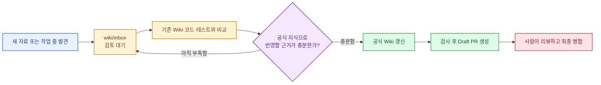

# Keepiluv-Agent

**Keepiluv(Twix)에 관한 프로젝트 지식과 AI 작업 규칙을 한곳에서 관리하는 저장소입니다.**

Keepiluv는 커플이 함께 목표를 만들고, 날짜별로 인증하며, 서로의 참여를 응원하는 Android 서비스입니다. 
이 저장소에는 다음 두 가지가 들어 있습니다.

- Keepiluv를 만들고 운영할 때 기준이 되는 **공식 Wiki**
- Codex가 여러 전문 Agent와 함께 안전하게 일하기 위한 **작업 규칙**

처음 방문했다면 [비개발자를 위한 Wiki 안내서](wiki/guide.md)를 읽거나 [Wiki 시작 화면](wiki/index.md)에서 궁금한 문서를 찾아보세요.

## 왜 필요한가요?

프로젝트를 오래 운영하다 보면 중요한 정보가 흩어집니다. 그 결과 사람과 AI가 같은 질문을 되풀이하거나 서로 다른 기준으로 판단할 수 있습니다.

이 저장소는 다음 내용을 한곳에 모아 그 문제를 줄입니다.

- Keepiluv가 어떤 서비스인지, 사용자가 어떤 과정을 경험하는지
- 기능을 만들 때 지켜야 할 구조, 도메인 지식과 테스트 기준
- 어떤 AI Agent가 어떤 작업을 맡는지
- 계획, 구현, 검토, 커밋과 Pull Request를 어떤 순서로 진행하는지
- 새 자료와 작업 중 발견한 지식을 어떻게 검토하고 공식 지식으로 확정하는지

## 사람과 AI가 나누어 하는 일

| 사람 | AI(Codex와 Agent) |
|---|---|
| 자료가 공개 가능한지 확인합니다. | 기존 Wiki, 코드와 테스트를 찾아 비교합니다. |
| 새로운 정책이나 의미를 결정합니다. | 승인받은 범위 안에서 문서를 정리하고 서로 연결합니다. |
| Draft PR에서 바뀐 내용을 검토합니다. | 링크, 형식, 출처와 변경 상태를 검사합니다. |
| 최종 내용을 승인하고 병합합니다. | 검토용 Draft PR을 만들고 리뷰 의견을 반영합니다. |

## 지식은 어떻게 쌓이나요?

새 정보가 곧바로 공식 지식이 되는 것은 아닙니다. 먼저 `wiki/inbox`에 보관하고, 근거와 실제 쓰임을 확인한 뒤 공식 Wiki에 반영합니다.

```mermaid
flowchart LR
    A["새 자료 또는 작업 중 발견"] --> B["wiki/inbox<br/>검토 대기"]
    B --> C["기존 Wiki·코드·테스트와 비교"]
    C --> D{"공식 지식으로<br/>반영할 근거가 충분한가?"}
    D -->|아직 부족함| B
    D -->|충분함| E["공식 Wiki 갱신"]
    E --> F["검사 후 Draft PR 생성"]
    F --> G["사람이 리뷰하고 최종 병합"]

    classDef input fill:#E8F1FF,stroke:#2563EB,color:#1E3A8A,stroke-width:1.5px
    classDef review fill:#FFF4D6,stroke:#D97706,color:#78350F,stroke-width:1.5px
    classDef decision fill:#F3E8FF,stroke:#7E22CE,color:#581C87,stroke-width:1.5px
    classDef official fill:#DCFCE7,stroke:#16A34A,color:#14532D,stroke-width:1.5px
    classDef human fill:#FFE4E6,stroke:#E11D48,color:#881337,stroke-width:1.5px

    class A input
    class B,C review
    class D decision
    class E,F official
    class G human
```

### Inbox에 들어가는 두 종류

| 종류 | 쉬운 뜻 | 예시 |
|---|---|---|
| `type: source` | 아직 정리하지 않은 새 자료 | 회의 메모, 참고 링크 |
| `type: knowledge-candidate` | 작업 중 발견한 비공식 지식 후보 | 여러 기능에서 다시 활용할 가능성이 있는 판단 기준 |

지식 후보는 검색되거나 읽혔다는 이유만으로 중요하다고 판단하지 않습니다. 서로 다른 작업의 계획, 구현, 테스트, 리뷰에서 실제 판단 근거로 쓰였을 때만 사용 이력을 남깁니다.

- 제품 정책, 사용자 흐름, 데이터 안전 규칙은 사용 횟수와 관계없이 바로 승격을 검토할 수 있습니다.
- 일반 후보는 서로 다른 작업에서 2회 이상 사용되면 공식 지식으로 승격할지 검토합니다.
- 조건을 충족해도 자동으로 승격하지 않습니다. 공식 Wiki 변경은 Draft PR에서 사람이 확인합니다.

자세한 기준은 [Wiki 자동 유지보수](wiki/schema/maintenance.md)와 [지식 후보 템플릿](wiki/templates/knowledge-candidate.md)에 있습니다.

## 문서의 신뢰 표시

각 Wiki 문서 위쪽에는 `authority`라는 관리 표시가 있습니다.

| 표시 | 쉬운 의미 | 사용 방법 |
|---|---|---|
| `canonical` | 검토된 공식 기준 | 프로젝트 사실과 운영 정책을 판단할 때 우선합니다. |
| `synthesized` | 공식 기준을 연결한 쉬운 해설 | 내용을 이해하는 데 사용하며, 충돌하면 `canonical`을 우선합니다. |
| `none` | 아직 공식이 아닌 자료나 후보 | 참고만 하고, 이것만으로 정책이나 사실을 확정하지 않습니다. |

필요할 때는 실제 코드, 테스트, 승인된 사용자 요구사항도 함께 확인합니다. 근거가 부족한 내용은 추측으로 확정하지 않고 `확인 필요`로 남깁니다.

## 처음에는 무엇을 보면 되나요?

| 궁금한 내용 | 먼저 볼 문서 |
|---|---|
| 이 저장소를 어떻게 사용하는지 | [Wiki 안내서](wiki/guide.md) |
| 전체 문서 목록과 이동 경로 | [Wiki 시작 화면](wiki/index.md) |
| Keepiluv가 어떤 서비스인지 | [프로젝트 개요](wiki/reference/project-overview.md) |
| 공식 용어의 뜻 | [도메인 용어집](wiki/reference/domain-glossary.md) |
| AI가 어떤 순서로 일하는지 | [Agent 작업 워크플로우](wiki/operations/workflows.md) |
| 어떤 Agent가 어떤 일을 하는지 | [Agent 목록](wiki/operations/agent-list.md) |
| 새 자료와 지식을 반영하는 과정 | [Wiki 운영 흐름](wiki/schema/workflow.md) |
| Wiki 자동 갱신과 승격 기준 | [Wiki 자동 유지보수](wiki/schema/maintenance.md) |

## 폴더 안내

| 위치 | 보관하는 내용 |
|---|---|
| `wiki/reference` | 서비스, 구조, 용어, 테스트에 관한 공식 지식 |
| `wiki/operations` | Agent를 선택하는 기준, 작업 순서와 승인 규칙 |
| `wiki/schema` | Wiki를 추가하고 검사하며 갱신하는 규칙 |
| `wiki/topics` | 여러 공식 문서를 연결한 쉬운 해설 |
| `wiki/inbox` | 미정리 자료와 비공식 지식 후보 |
| `wiki/sources` | 외부 자료의 주소와 확인 정보 |
| `wiki/decisions` | 중요한 결정과 그 이유 |
| `wiki/templates` | 새 문서를 작성할 때 사용하는 양식 |
| `.codex/agents` | 각 전문 Agent의 역할과 행동 규칙 |
| `.agents/skills` | 코드와 작업에 적용하는 상세 절차 |
| `AGENTS.md` | 전체 운영 정책의 최상위 요약 |

## 안전 원칙

이 저장소는 공개될 수 있으므로 다음 원칙을 지킵니다.

- 비밀번호, 인증 토큰, 개인키와 서비스 비밀값을 저장하지 않습니다.
- 개인정보, 고객 정보와 공개되지 않은 사내 기밀을 저장하지 않습니다.
- 외부 글 전체를 허락 없이 복사하지 않고, 필요한 경우 주소와 핵심 요약만 남깁니다.
- 공식 지식의 변경은 검사와 Draft PR 리뷰를 거칩니다.
- AI는 Draft PR을 자동으로 병합하지 않습니다. 최종 승인과 병합은 사람이 합니다.
- 후보 지식(`authority: none`)만으로 제품 사실이나 운영 정책을 확정하지 않습니다.

공개해도 되는지 확실하지 않다면 저장하기 전에 민감정보 검사를 요청하고, 사람이 한 번 더 확인해야 합니다. 자세한 내용은 [출처 정책](wiki/schema/source-policy.md)을 참고하세요.

## Agent 작업 방식

Codex는 요청의 목적에 맞는 담당 Agent를 정합니다. 여러 역할이 필요하면 정해진 순서에 따라 다음 Agent에게 작업을 넘깁니다.

```mermaid
flowchart LR
    U["사용자 요청"] --> R["의도와 범위 확인"]
    R --> P["계획"]
    P --> T["테스트"]
    T --> I["구현"]
    I --> V["리뷰와 Wiki 동기화"]
    V --> C["커밋"]
    C --> PR["Pull Request"]

    classDef request fill:#E8F1FF,stroke:#2563EB,color:#1E3A8A,stroke-width:1.5px
    classDef design fill:#F3E8FF,stroke:#7E22CE,color:#581C87,stroke-width:1.5px
    classDef execution fill:#DCFCE7,stroke:#16A34A,color:#14532D,stroke-width:1.5px
    classDef review fill:#FFF4D6,stroke:#D97706,color:#78350F,stroke-width:1.5px
    classDef git fill:#FFE4E6,stroke:#E11D48,color:#881337,stroke-width:1.5px

    class U request
    class R,P design
    class T,I execution
    class V review
    class C,PR git
```

대표 흐름은 다음과 같습니다.

| 상황 | Agent 흐름 |
|---|---|
| 위치나 사용처 찾기 | `explore` |
| 모호한 요구사항 정리 | `interviewer → planner` |
| 일반 기능 구현 | `planner → tester → implementer` |
| 빠른 버그 수정 | `explore → tester → implementer` |
| 구조 개선 | `analyst → planner → tester → implementer` |
| 품질 검토 | `code-reviewer` |
| Wiki 지식 동기화 | `implementer → wiki-maintainer` |
| Git 마무리 | `committer → pr-creator` |

구현 범위가 분명한 요청은 해당 범위의 구현을 승인한 것으로 봅니다. 별도 계획이 필요한 작업은 계획을 먼저 보여주고 승인을 받은 뒤 시작합니다. 일반 코드의 커밋과 PR 생성에는 각각 사람의 승인이 필요합니다. 승인된 Wiki 전용 작업은 검사 후 Draft PR까지 자동으로 준비할 수 있지만, 최종 병합은 언제나 사람이 수행합니다.

세부 기준은 [최상위 운영 정책](AGENTS.md), [Agent 라우팅 규칙](wiki/operations/routing-rules.md), [Agent 작업 워크플로우](wiki/operations/workflows.md)에서 확인할 수 있습니다.

## 기준 문서

| 주제 | 기준 |
|---|---|
| 전체 운영 정책 | `AGENTS.md` |
| 프로젝트 공식 지식의 시작점 | `wiki/index.md` |
| Agent 선택 기준 | `wiki/operations/routing-rules.md` |
| Agent 실행 순서 | `wiki/operations/workflows.md` |
| Wiki 운영 흐름 | `wiki/schema/workflow.md` |
| Wiki 자동 유지보수 | `wiki/schema/maintenance.md` |
| 각 Agent의 실제 행동 | `.codex/agents/**` |
